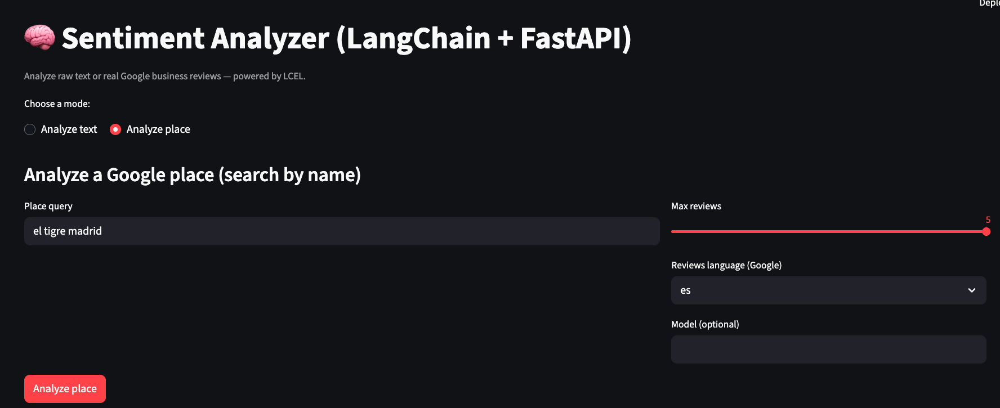

# 🧠 Google Reviews Sentiment Analysis

<div align="center">

**A hands-on sentiment analysis application that analyzes Google Business reviews using LangChain LCEL and OpenAI**

[](https://www.python.org/)
[](https://www.langchain.com/)
[](https://openai.com/)
[](https://fastapi.tiangolo.com/)
[](https://streamlit.io/)

*Perfect for learning LangChain LCEL, sentiment analysis, and LLM-powered business intelligence*

</div>

---

## 🎯 What is This Project?

This is a **complete sentiment analysis application** that demonstrates how to build an intelligent system that:

- Fetches real Google Business reviews automatically
- Analyzes sentiment using state-of-the-art LLMs
- Extracts key aspects (service, food, price, etc.)
- Provides actionable insights for businesses

**Perfect for students learning:**

- 🤖 LangChain LCEL (LangChain Expression Language)
- 💬 LLM prompt engineering and structured outputs
- 🌐 Google Places API integration
- 📊 Sentiment analysis and aspect extraction
- 🚀 Building full-stack AI applications

---

## ✨ Key Features

| Feature | Description |
|---------|-------------|
| 🧠 **Advanced Sentiment Analysis** | Powered by OpenAI GPT models via LangChain |
| 📍 **Google Places Integration** | Automatically fetch reviews from any business |
| 🎯 **Aspect Extraction** | Identifies what customers talk about (service, food, price, etc.) |
| 🌍 **Multi-language Support** | Automatic language detection and analysis |
| 📊 **Sentiment Scoring** | Precise scores from -1 (very negative) to +1 (very positive) |
| ⚡ **Batch Processing** | Analyze multiple reviews in parallel |
| 🎨 **Dual Interface** | Both Streamlit web UI and FastAPI REST API |
| 🔄 **LangChain LCEL** | Composable and maintainable chains |
| 🚀 **Production Ready** | Async/await, type hints, error handling, and best practices |

---

## 🏗️ Architecture Overview

```
┌─────────────────┐
│   User Query    │  "Analyze reviews for Joe's Pizza"
└────────┬────────┘
         │
         ▼
┌─────────────────────────────────────┐
│      Google Places API              │
│  ┌───────────────────────────────┐  │
│  │  1. Find place by query       │  │
│  │  2. Fetch business reviews    │  │
│  └──────────────┬────────────────┘  │
└─────────────────┼────────────────────┘
                  │
                  ▼
┌─────────────────────────────────────┐
│      LangChain LCEL Pipeline        │
│  ┌───────────────────────────────┐  │
│  │  1. Preprocess & normalize    │  │
│  │     review text               │  │
│  └──────────────┬────────────────┘  │
│                 │                    │
│  ┌──────────────▼────────────────┐  │
│  │  2. LLM analyzes sentiment    │  │
│  │     & extracts aspects        │  │
│  └──────────────┬────────────────┘  │
│                 │                    │
│  ┌──────────────▼────────────────┐  │
│  │  3. Parse structured output   │  │
│  │     (Pydantic models)         │  │
│  └──────────────┬────────────────┘  │
└─────────────────┼────────────────────┘
                  │
                  ▼
         ┌────────────────┐
         │  Sentiment     │
         │  Results +     │
         │  Insights      │
         └────────────────┘
```

---

## 🛠️ Tech Stack

<div align="center">

| Category | Technology | Purpose |
|----------|-----------|---------|
| **🤖 AI/ML** | LangChain LCEL | Chain orchestration and composability |
| | OpenAI GPT-4o-mini | LLM for sentiment analysis |
| **🌐 Backend** | FastAPI | REST API server |
| **💻 Frontend** | Streamlit | Interactive web interface |
| **🔌 APIs** | Google Places API | Business reviews retrieval |
| **📦 Data** | Pydantic | Type-safe models and validation |
| **⚙️ Tools** | uv | Fast Python package manager |
| | Python 3.10+ | Programming language |

</div>

---

## 📦 Project Structure

```
google-reviews-sentiment/
├── app/
│   ├── __init__.py
│   ├── config.py              # ⚙️ Configuration & environment variables
│   ├── main.py                # 🚀 FastAPI app & endpoints
│   ├── chains.py              # 🧠 LangChain LCEL chains
│   ├── schemas.py             # 📊 Pydantic models
│   ├── ui.py                  # 🎨 Streamlit web interface
│   │
│   ├── review_clients/
│   │   ├── __init__.py
│   │   ├── base.py            # 🔌 Base client interface
│   │   └── google_places.py   # 📍 Google Places API client
│   │
│   └── utils/
│       ├── __init__.py
│       └── text_clean.py      # 🧹 Text normalization utilities
│
├── pyproject.toml             # 📋 Dependencies & project config
├── uv.lock                    # 🔒 Lock file
└── README.md
```

---

## 🚀 Quick Start

### Prerequisites

- **Python 3.10+** installed
- **OpenAI API Key** ([Get one here](https://platform.openai.com/api-keys))
- **Google Maps API Key** ([Get one here](https://developers.google.com/maps/documentation/places/web-service/get-api-key))

### Installation Steps

#### 1️⃣ Install uv (if needed)

```bash
curl -LsSf https://astral.sh/uv/install.sh | sh
```

#### 2️⃣ Clone and Navigate

```bash
git clone https://github.com/JaimeLucena/google-reviews-sentiment.git
cd google-reviews-sentiment
```

#### 3️⃣ Install Dependencies

```bash
uv sync
```

This will create a virtual environment and install all required packages.

#### 4️⃣ Configure Environment

Create a `.env` file in the root directory:

```bash
# Required
OPENAI_API_KEY=sk-your-api-key-here

# Optional - for Google Reviews analysis
GOOGLE_MAPS_API_KEY=your-google-maps-api-key-here

# Optional - Service configuration
SERVICE_NAME=sentiment-service
MODEL_NAME=gpt-4o-mini
HOST=0.0.0.0
PORT=8000
```

> 💡 **Tip**: Never commit your `.env` file! It's already in `.gitignore`

---

## 🎮 Usage

### 1️⃣ Start the Backend (FastAPI)

First, start the FastAPI server:

```bash
uv run uvicorn app.main:app --reload
```

The API will be available at **http://localhost:8000**

> 💡 **Note**: Keep this terminal running. The Streamlit frontend needs the backend to be running.

### 2️⃣ Start the Frontend (Streamlit)

In a new terminal, launch the interactive web interface:

```bash
uv run streamlit run app/ui.py
```

Then open your browser to **http://localhost:8501**

**Features:**

- 💬 Two analysis modes: arbitrary text or Google business reviews
- 📊 Visual analytics with aggregated insights
- 🎨 Clean, modern UI with sentiment badges
- 📈 Aspect extraction and scoring
- 📝 Individual review analysis

### 3️⃣ Using the REST API Directly (Optional)

If you prefer to use the API directly without the web interface, you can interact with the endpoints:

**Interactive API Docs:** Visit **http://localhost:8000/docs** for Swagger UI

#### API Endpoints

| Method | Endpoint | Description |
|--------|----------|-------------|
| `GET` | `/healthz` | Health check |
| `POST` | `/analyze/text` | Analyze arbitrary text |
| `POST` | `/google/find-place` | Find Google Place ID by query |
| `POST` | `/google/analyze-reviews` | Analyze reviews by Place ID |
| `POST` | `/google/analyze-by-query` | Search & analyze (all-in-one) |

#### Example API Request

```bash
curl -X POST "http://localhost:8000/google/analyze-by-query" \
  -H "Content-Type: application/json" \
  -d '{
    "query": "Best Pizza Restaurant New York",
    "limit": 5,
    "language": "en"
  }'
```

**Response:**

```json
{
  "query": "Best Pizza Restaurant New York",
  "place_id": "ChIJd8BlQ2BZwokRAFUEcm_qrcA",
  "review_count": 5,
  "results": [
    {
      "text": "Amazing pizza! Great service...",
      "label": "positive",
      "score": 0.85,
      "rationale": "Customer expresses high satisfaction...",
      "aspects": [
        {"aspect": "food quality", "label": "positive", "score": 0.9},
        {"aspect": "service", "label": "positive", "score": 0.8}
      ]
    }
  ]
}
```

---

## 💡 Example Use Cases

Try these examples to see sentiment analysis in action:

### Analyze Google Business Reviews

- `"Analyze reviews for Joe's Pizza New York"`
- `"Show me sentiment for El Tigre Madrid"`
- `"What do customers say about Starbucks Times Square?"`

### Analyze Arbitrary Text

- `"Great service, highly recommended!"`
- `"Terrible experience, never coming back"`
- `"The food was okay but the service was slow"`

### Business Intelligence

- Monitor competitor reviews
- Track customer satisfaction trends
- Identify common complaints or praises
- Extract actionable insights from feedback

---

## 🧠 How Sentiment Analysis Works Here

### Step-by-Step Process

1. **User Input** → Natural language query or text

   ```
   "Analyze reviews for Joe's Pizza"
   ```

2. **Google Places API** → Fetch business reviews

   ```
   Returns: 5 reviews from Google Business
   ```

3. **Text Preprocessing** → Normalize and clean text

   ```
   Removes extra whitespace, normalizes encoding
   ```

4. **LangChain LCEL Chain** → Analyze sentiment

   ```
   - Prompt engineering with system instructions
   - LLM generates structured JSON response
   - Pydantic parser validates output
   ```

5. **Result Formatting** → Structured sentiment data

   ```
   {
     "label": "positive",
     "score": 0.85,
     "aspects": [{"aspect": "service", "score": 0.9}]
   }
   ```

### Key Components

- **`app/chains.py`**: Core LangChain LCEL implementation
  - Sentiment analysis chain
  - Structured output parsing
  - Batch processing support

- **`app/review_clients/google_places.py`**: Google Places integration
  - Place search by query
  - Review fetching
  - Async HTTP requests

- **`app/schemas.py`**: Pydantic models
  - Type-safe request/response models
  - Sentiment labels and scores
  - Aspect extraction models

---

## 📊 Response Schema

### Sentiment Analysis Result

```python
{
  "text": str,                    # Original review text
  "language": Optional[str],      # Detected language
  "label": "positive" | "neutral" | "negative",
  "score": float,                 # -1.0 to 1.0
  "rationale": str,               # Explanation
  "aspects": [                    # Extracted aspects
    {
      "aspect": str,              # e.g., "service", "food"
      "label": "positive" | "neutral" | "negative",
      "score": float              # -1.0 to 1.0
    }
  ]
}
```

### Scoring System

- **Negative**: -1.0 to -0.05
- **Neutral**: -0.05 to 0.05
- **Positive**: 0.05 to 1.0

---

## 🎓 Learning Objectives

By exploring this project, you'll learn:

✅ **LangChain LCEL Patterns**

- Building composable chains with `|` operator
- Prompt templates and system messages
- Structured output parsing with Pydantic
- Batch processing with `abatch()`

✅ **Sentiment Analysis**

- Converting text to structured sentiment data
- Aspect extraction from reviews
- Multi-language support
- Scoring and classification

✅ **API Integration**

- Google Places API usage
- Async HTTP requests with httpx
- Error handling and retries
- API key management

✅ **Full-Stack AI Apps**

- Building REST APIs for AI services
- Creating interactive UIs with Streamlit
- Type-safe models with Pydantic
- Async/await patterns

✅ **Best Practices**

- Modular code organization
- Environment configuration
- Error handling
- Type hints and static checking

---

## 🔧 Development

### Running Tests

```bash
uv run pytest
```

### Code Formatting

```bash
uv run ruff format .
uv run ruff check .
```

### Project Scripts

```bash
# Run Streamlit app
uv run streamlit run app/ui.py

# Run FastAPI server
uv run uvicorn app.main:app --reload
```

---

## 🤔 Common Questions

**Q: Why LangChain LCEL instead of direct OpenAI calls?**  

A: LCEL provides composability, maintainability, and easy chain building. It's perfect for learning modern LLM patterns.

**Q: Can I use a different LLM?**  

A: Yes! LangChain supports many providers. Just change the LLM initialization in `app/chains.py`.

**Q: How do I analyze reviews in other languages?**  

A: Set the `language` parameter in your request. The system supports automatic language detection.

**Q: Is this production-ready?**  

A: This is a learning project. For production, add authentication, rate limiting, logging, monitoring, and caching.

**Q: What's the difference between `/analyze/text` and `/google/analyze-by-query`?**  

A: The first analyzes arbitrary text you provide. The second fetches reviews from Google Places and analyzes them.

---

## 📚 Additional Resources

- [LangChain LCEL Documentation](https://python.langchain.com/docs/expression_language/)
- [FastAPI Documentation](https://fastapi.tiangolo.com/)
- [Streamlit Documentation](https://docs.streamlit.io/)
- [OpenAI API Reference](https://platform.openai.com/docs/)
- [Google Places API Documentation](https://developers.google.com/maps/documentation/places/web-service)
- [Pydantic Documentation](https://docs.pydantic.dev/)

---

## 📝 License

MIT License - see [LICENSE](LICENSE) file for details

---

## 🙏 Acknowledgments

Built with ❤️ for students learning AI, LangChain, and sentiment analysis.

**Happy Learning! 🚀**

---

<div align="center">

**Made with** ❤️ **for the AI learning community**

⭐ **Star this repo if you found it helpful!**

</div>
